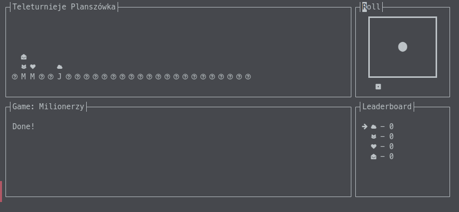
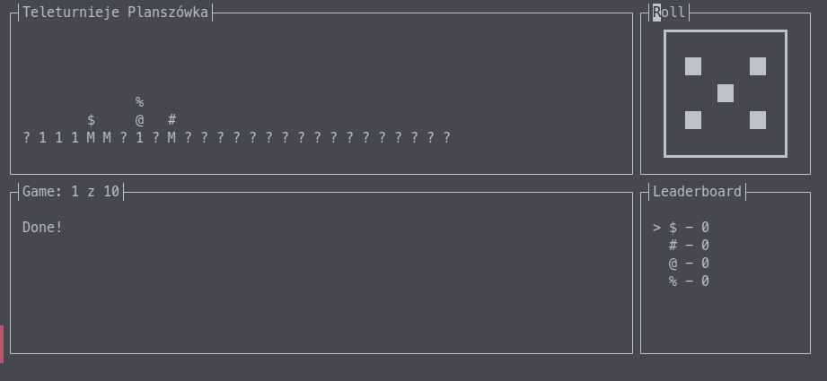

# TV Game Show board game in Python Curses
...yeah



## Wat
I'm working on a board game and decided to prototype it in curses rather than cardboard, or anything reasonable to be honest.

## Run
```bash
python3 -m venv venv
source venv/bin/activate
python3 main.py
```
### Options:
Defaults are 4 players without NF.
- `-p --players` - specifies player count. Max is 5 due to my arbitrary screen constraints.
- `-c STRING --custom STRING` - specify custom characters for players
  - ex: `-c a1*+` will make players `a`, `1`, `*` and `+`
- `-n --nerd-font` - enables Nerd Font
  - You'll need a Nerd Font installed like [Meslo LGS NF](https://github.com/romkatv/powerlevel10k/blob/master/font.md)
